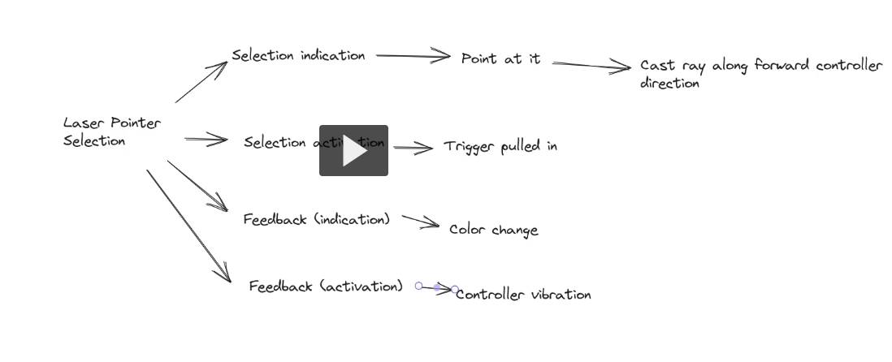

**Date: 10/5/23 Thursday**

How does Meta Quest tracking works?
controllers - constillation tracking
Inertial measurement inside controllers to track rotation

Eye tracking - Quest has IR sensing/ sendign IR into eyes to get the movement of eyes, problem with having glasses i.e., 4 eyes

**Date: 10/10/23 Tuesday**
What makes 3D interaction difficult?
 - 8 things in slides, out of which lack of standards is the major one.

Universal 3D Interaction Tasks in 3D:
1) Object Interaction:
    Selection & Manuplation comes under this.

**Selection**

**Manuplation**

Selection & Manuplation Tasks:
- Canonical Tasks
    Selection, positioning, Rotating, Scaling

Selection & Manuplation Techniques:

Grips:

Clutching:
    when we use mouse we face this, when we ran out of space in physical world we lift the mouse and reset i.e., put it in the center.

Classification by Task Decomposition:

Classification Metaphors:
- Grasping - selecting 

Grasping - Go-Go Technique {physically grabbing}
    Inspector gadget - old american cartoon - gogo gadget
    This is an arm extension technique.
    Ex: Hand moves in the 3D to far to get an object, in physical world user needs not to move that distance to get the object, only the hand moves, it's like an hand extension.

    Enhancements: 
        - PRISM
        Moving the controller in same velocity as the obects moving in 3D, so that we can control

**Date: 10/12/2023 Thursday** 

***LAB***

Creating a Light Saber, in Unity.

In assignment add sound/audio when cube destroys, 
    Prof suggested to try the sound effect on the blade.

**Date: 10/17/2023 Tuesday**

Class

Continuation of Metophors:
2nd metaphor - Pointing
- **Ray casting** i smost common means when we point controller, a laser pointing towards the side, we are pointing.

Problem of precision => **Image plane pointing**, where ray comes from head and we point with the index and middle finger by pinching.

**Aperture selection**: It's like cone

**Expand** - technique useful in dense environment and not much precision.
- non isomorphic 

**Enhancements**
- Absolute and relative - on thursday go through this.

## Surface

3rd in metaphors
, 2D
- void shadows:  
- baloon selection: most common one, pointing on seuface on virtual env, 1finger is static and other finger moves to increase the height and other finger or a click to select/de-select
- cork skrew widget: 
- Triangle Cursor: putting 2 fingers index and thumb on screen, pulling them close decreases the height and viceversa

## Indirect 

4th in metoaphors

- virtual pad: 
- proxy technique: world-in-miniature (WIM): 
- Voodoo Dolls: moving the doll in physical world then object resembles and moves in virtual world.
- widget techniques: 

## Bimanual

5th in metaphors

uses 2 controllers

- both these can be symmetric and non symmetric...

users typically have dominat and non dominant hand, fine precision adjustments needs to give to the dominant hand

- Spindle: 2 6DOF controllers, you masy use it for scaling advantage.

- Interaction based spatial interaction for two hands (ISIth): mid point of the rays from controllers, can select the oject.

- Assymetric Bimanual techniques:
    -  Spindle + Wheel: 
    -  flexible pointer: Bezeir curve - rotate one controller to move the curve

**Bimanual Volumetric Selection** 

## Hybrid

last in metaphors

- HOMER: 
- scaled world grab: 

**Date: 10/19/2023 Thursday**

Lab: watch recording 

Laser pointing and selecting. 

Add music to the Beat saber project, which is due on the coming Thursday.

**Date: 10/24/2023 Tuesday**

Class topic is navigation

Expained/discussed Quiz 3

Navigation:

Visual and Vestibular Cues
Spatial reference frames

Search 
    - Naive: 

Locomotion parameters:

Locomotion Metaphors:

**Walking** #1

Full Gait technique:

-   Real-walking

-   scaled-walking

-   Visual Dominance

-   Redirected Walking

Partial Gait Techniques:

-   walking in place varienta (dont get as much as head movement)
    - marching in place (commonly used)
    - swinging in place (never seen in actual applications)
    - tapping in place

- Arm-Based Walking-in-place

- Human Joystick

Gait Negation Technique:

- Treadmill Technique

- Passive Omnidirection Treadmill

- Low Friction Surfaces - skyrim game ig in the video

- Step-Based Devices

Steering #2 in next week

**Date: 10/26/2023 Thursday**

Lab

Lecture - 14

Watched till 22:41

**Date: 10/31/2023 Tuesday**

class

lean-direction: penguFly example

walking vs steering
- spatial awareness task

Iowa bicycle simulator example

Selection-based locomotion
1. target based
    - teleportation: {final programming assignment}
        - implemented using parabolic arc
        - rapid transition
        ex: some game: pointing in somedirection moves the player
        - teleportation with direction specific - orientation also changing with something like joystick 
1. dual-target techniques
        - zoomback
1. representation-based techniques

1. path drawing

1. marking points: easier variation than path drawing

Locomotion metaphors

Manipulation-based locomotion
view point manipulation
1. camera manipulation
    - hand controlls camera
2. avatar manipulation

3. fixed object manipulation

world manipulation
1. single point world manipulation

2. dual point world manipulation

Hybrid techniques
- room-scale VR
    - mostly used in oculus like selection play area
    - benefit walking for maneuvering task
- chaperones/ guardians
    - mesh like structure when we are almost in the end of the pay area

Design considerations:
    - velocity changing
    - turning: 
    - vertical locomotion
    - multiple locomotion modes

components of navigation:
- wayfinding

- landmark knowledge

- survey knowledge - cardnial system of direction like N, E, W, S

wayfinding cues:
- user-centered wayfinding cues
    - 
- environment-centered wayfinding cues
    
environment legibility

wayfinding aids

maps and compass

**Date: 11/02/2023 Thursday**

Lab

Snap turning implementation to reduce sickness

Lecture - 16

Depth Ray and Reach Controlling.

using System.Collections;
using System.Collections.Generic;
// using UnityEditor.UI;
using UnityEngine;

public class LaserSelector : MonoBehaviour
{

    public Material laserMaterial;
    public Material indicationMaterial;
    public Material activationMaterial;

    public float vibrationTime = 0.5f;

    public GameObject selectionSphere;
    public float sphereSpeed = 5.0f;

    private LineRenderer lineRenderer;
    private GameObject indicatedGameObject = null;
    private Material tmpMaterial;

    private bool vibrating = false;
    private float elapsedVibrationTime = 0.0f;

    private GameObject selectedGameObject = null;

    private float selectionRadius = 0.0f;

    // Start is called before the first frame update
    void Start()
    {
        lineRenderer = GetComponent<LineRenderer>();
        lineRenderer.material = laserMaterial;
    }

    // Update is called once per frame
    void Update()
    {
        
        Vector3 sphereTranslation = new Vector3(0.0f, 0.0f, OVRInput.Get(OVRInput.RawAxis2D.RThumbstick).y * sphereSpeed * Time.deltaTime);
        selectionSphere.transform.Translate(sphereTranslation, Space.Self);

        if (selectionSphere.transform.localPosition.z < 0.0f)
        {
            selectionSphere.transform.localPosition = Vector3.zero;
        }

        lineRenderer.SetPosition(0, transform.position);
        lineRenderer.SetPosition(1, transform.position + transform.forward * 100f);
    }
}

### Reach Controller script
using System.Collections;
using System.Collections.Generic;
using UnityEngine;

public class ReachingController : MonoBehaviour
{
    public float gain = 1.0f;
    public Transform physicalController;

    private Vector3 physicalLastPos;

    // Start is called before the first frame update
    void Start()
    {
        physicalLastPos = physicalController.position;
        transform.position = physicalController.position;
    }

    // Update is called once per frame
    void Update()
    {
        // transform.position = physicalController.position;
        Vector3 physicalControllerChange = physicalController.position - physicalLastPos;

        transform.Translate(physicalControllerChange * gain, Space.World);

        if (OVRInput.Get(OVRInput.RawButton.A))
        {
            transform.position = physicalController.position;
        }

        transform.rotation = physicalController.rotation;
        physicalLastPos = physicalController.position;
    }
}
Process for this **Reach Controller**:
- uncheck the ovr controller prefab which is under the right controller anchor
- create an empty gameobject - rename it to VirtualControllerAnchor
- Add OVR Controller prefab and change controller to RTouch
- add reachingcontroller script to virtualcontrolanchor

No Quiz this week, Assignment 4 due on Next week Thursday

**Date: 11/07/2023 Tuesday**

Class - Redirected walking

Natural Locomotion - we can't physically have that much space for walking an entire builing in VR, so we need Redirected walking

Translation Gain:

If walking in physical world is 1m then walking in virtual world is 2m, like wise 

Rotation Gain: Amplyfying rotation

if rotatied 180deg in physical world then rotate 360deg in virtual world

Hardest thing - congnotively seperating physical and virtual world/representations

Curvature Gain:

rotating body in opposite direction

psychometric Techniques:

Redirected Walking Algorithm Continuum:

Dynamic path planing algorithm:

Static Path Planning Algorithms:

Environment Alignment:

Change blindness redirection:

**Date: 11/09/2023 Thursday**

Project Proposal:

Types

1) Application based project

2) Interaction based - designing a new technique or implementing complex from research paper

3rd question: Description

4th question: whats required to accomplish

5th question: how it should be evaluated, like milestones

3DUI contest 

Check in this for the old conferences for project Ideas

We decided as now as VR Racing game

**Date: 11/14/2023 Tuesday**

Quiz 4 discussion

Class: System control part - 1

Human factors: perceptual issues

screen door effect

Human factors: cognitive issues

Human factors: Ergonomic Issues

### System Controller Interfaces:

#### Physical Controllers

- convenience is good 

#### Graphical Menus

**Date: 11/16/2023 Thursday**

#### Voice commands

ex: SimSensei human interaction

#### Gestural Commands

Posture: a static configuration of the hand

Gesture: moving hand to make a symbol or a letter

Ex: VR + Kinect 
-- putting long gestures is a very bad idea (did a task like holding hands for a minute, it started paining)

#### Tools usage

Reactable eg

#### Multimodal Techniques

hololens for multimodal input

#### System Control Design Guidelines

- see the PPT

Today is the submission for Assignment - 4 and Project Proposal
