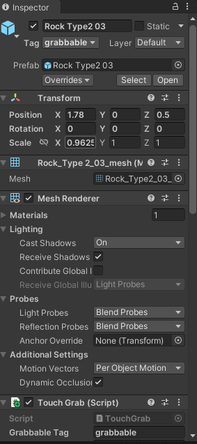
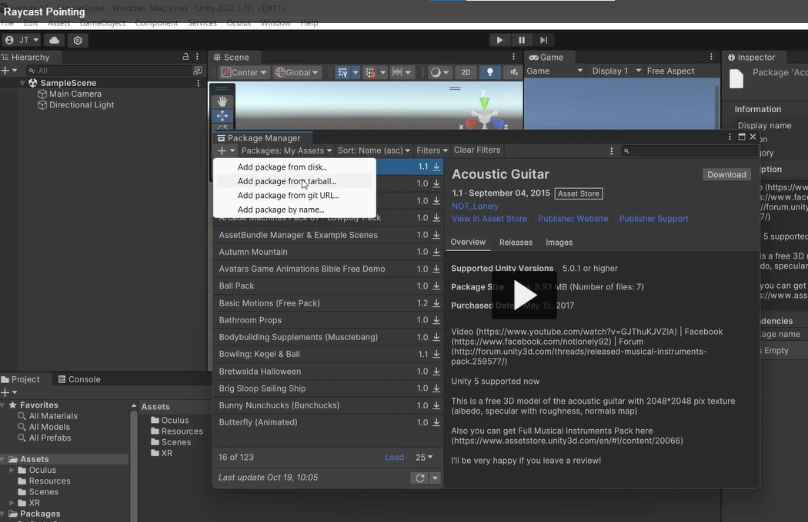

After importing Oculus, Click on Oculus tab > click on Download Meta XR Simulator(just below the tools)
It will open a pop up, click on download
Routes to some web page, you can see some download, see below image:

Then it will be in downloads.

Goto Windows tab > package manager > click on + and add package tarball

Navigate to the file in downloads, then it will install this to the project.

you need to do it for every project manually